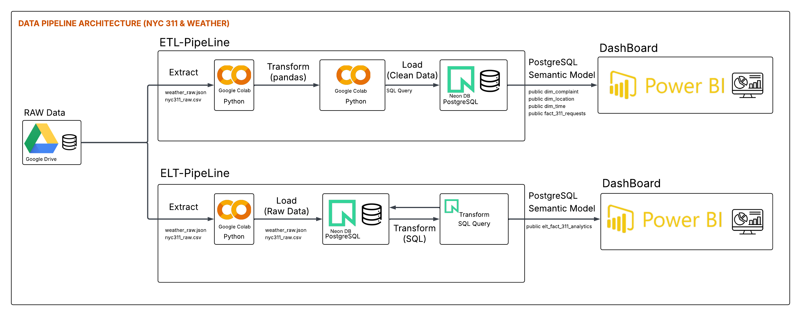
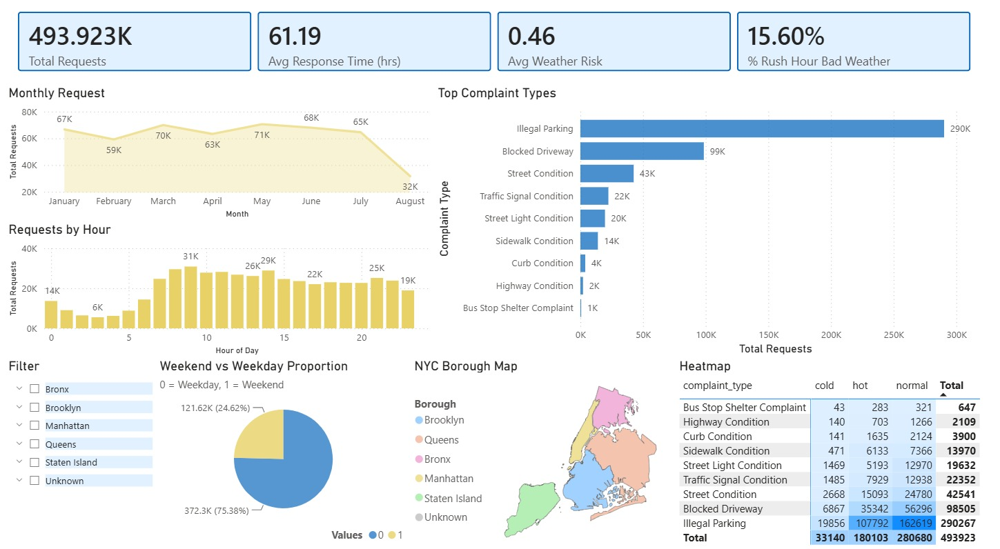
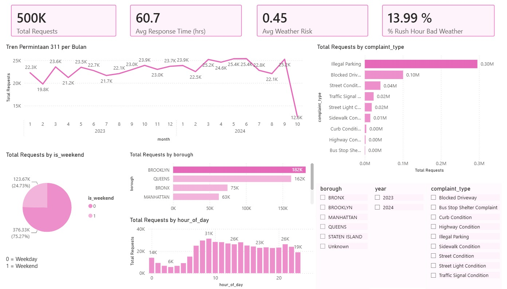

# Big Data Analytics: Komparasi Pipeline ETL vs ELT (NYC 311 & Weather)

Proyek ini merupakan studi komparatif implementasi *data pipeline* menggunakan dua arsitektur berbeda: **ETL (Extract, Transform, Load)** dan **ELT (Extract, Load, Transform)**. Proyek ini ditujukan untuk menganalisis dampak cuaca terhadap pola permintaan layanan masyarakat di New York City (NYC 311) sebagai bagian dari pemenuhan Tugas Besar UAS Big Data.

**Tim Pengembang (Computer Engineering, Telkom University):**
1. **Atha Aulia Shidiq** - ELT Pipeline & Blue Dashboard
2. **Pricilia Apriana** - ETL Pipeline & Pink Dashboard

---

## 📌 Deskripsi Proyek & Perbandingan Arsitektur
Proyek ini mengekstraksi dataset yang sama (CSV NYC 311 dan JSON Open-Meteo API), namun diproses melalui dua *pipeline* yang berbeda untuk membandingkan efisiensi dan metodenya:

*   **Arsitektur ETL (Oleh Pricilia Apriana):**
    Data diekstrak, kemudian **ditransformasi secara ekstensif menggunakan Python (Pandas)** di memori Colab (pembersihan, normalisasi, dan *join*). Setelah data bersih dan membentuk tabel *Fact*, barulah data dimuat (*Load*) ke dalam *data warehouse* Neon DB.
*   **Arsitektur ELT (Oleh Atha Aulia Shidiq):**
    Data diekstrak dan **langsung dimuat (Load) dalam kondisi mentah (Raw)** ke dalam tabel *staging* Neon DB. Seluruh proses transformasi, *parsing* JSON, dan *feature engineering* dieksekusi secara native di dalam *database* menggunakan instruksi **SQL murni**.

## 🛠️ Cara Menjalankan Proyek (Reproducibility)
Proyek ini menyediakan dua *notebook* Google Colab yang berjalan secara independen.
1. Pastikan file raw `nyc311_raw.csv` dan `weather_raw.json` berada di direktori yang diatur dalam *notebook* (lihat link Google Drive di bawah).
2. **Menjalankan Pipeline ETL:** Buka file `etl_pipeline/etl_pipeline_nyc311.ipynb`, jalankan semua *cell*. Transformasi akan terlihat pada log proses Pandas sebelum masuk ke *database*.
3. **Menjalankan Pipeline ELT:** Buka file `elt_pipeline/elt_pipeline_nyc311.ipynb`, jalankan semua *cell*. Proses *Load* awal akan memuat data mentah utuh, dilanjutkan dengan eksekusi script SQL yang membangun *View/Table Fact* di dalam Neon DB.

*(Catatan: Kredensial Neon DB sengaja tidak disertakan demi keamanan. Silakan gunakan connection string PostgreSQL Anda sendiri pada variabel `DATABASE_URL` jika ingin melakukan verifikasi run).*

## 📂 Dokumentasi Dataset
**Dataset untuk menjalankan pipeline disimpan di Google Drive karena ukurannya melebihi batas GitHub (830 MB).**
*   **Link Penyimpanan Data Mentah:** https://drive.google.com/drive/folders/1rtflPT1ffWJuTZHfhqoU3A3-TvgjWqg4?usp=sharing

*(Untuk menjalankan ulang Colab, silakan unduh file dari tautan di atas dan letakkan sesuai path yang ada di script).*

1. **NYC 311 Service Requests**
   - **Link Asal Dataset:** [NYC Open Data - 311 Service Requests](https://data.cityofnewyork.us/Social-Services/311-Service-Requests-from-2010-to-Present/erm2-nwe9)
   - **Penjelasan Singkat:** Rekaman historis sistem layanan non-darurat 311 Kota New York yang mencatat laporan warga terkait infrastruktur jalan, lalu lintas, dan transportasi. Pada proyek ini data difilter pada 9 kategori *transport-related* untuk periode 2023–2024.

2. **Historical Weather Data API**
   - **Link Asal Dataset:** [Open-Meteo Historical Weather API](https://open-meteo.com/en/docs/historical-weather-api)
   - **Penjelasan Singkat:** Data cuaca historis Kota New York dengan resolusi per jam (suhu, kelembapan, presipitasi, hujan, salju, kode cuaca, dan kecepatan angin), ditarik via REST API untuk periode yang sama dengan data 311 lalu digabungkan berdasarkan waktu.

## 🗄️ Dokumentasi Data Warehouse
Meskipun mengekstraksi data yang sama, kedua *pipeline* menghasilkan **struktur warehouse yang berbeda**: pipeline **ETL** membentuk **star schema** (1 tabel fakta + 3 tabel dimensi), sedangkan pipeline **ELT** menghasilkan **satu tabel analitik datar (*flat table*)**. Detail *Data Lineage* dan ERD dapat dilihat pada file `architecture_diagram.png`.

### Struktur Tabel Analitik Final (ETL — Star Schema)

Pipeline ETL menghasilkan **star schema**: 1 tabel fakta (`fact_311_requests`) yang terhubung ke 3 tabel dimensi melalui *foreign key*.

**Tabel Fakta — `fact_311_requests`**

| Nama Kolom | Keterangan |
| :--- | :--- |
| `fact_id` | Primary Key (surrogate key), nomor urut otomatis tiap baris fakta |
| `unique_key` | ID unik laporan 311 (natural key, UNIQUE NOT NULL) |
| `time_id` | Foreign Key → `dim_time(time_id)` |
| `location_id` | Foreign Key → `dim_location(location_id)` |
| `complaint_id` | Foreign Key → `dim_complaint(complaint_id)` |
| `response_time_hours` | Durasi penyelesaian laporan dalam jam |
| `open_data_channel_type` | Kanal masuknya laporan (ONLINE, PHONE, MOBILE, dll) |
| `weather_risk_score` | Kombinasi risiko curah hujan dan angin kencang |
| `temperature_2m` | Suhu udara (Normalisasi Min-Max) |
| `precipitation` | Curah hujan (Imputasi & *clipping* IQR) |
| `wind_speed_10m` | Kecepatan angin (Normalisasi Min-Max) |
| `is_rainy` | 1 jika hujan saat laporan masuk, 0 jika tidak |
| `temp_category` | Kategori suhu: cold / normal / hot |
| `rush_hour_bad_weather` | 1 jika jam sibuk DAN cuaca buruk/hujan, 0 jika tidak |

**Tabel Dimensi — `dim_time`**

| Nama Kolom | Keterangan |
| :--- | :--- |
| `time_id` | Primary Key (surrogate key) |
| `created_hour` | Waktu laporan dibulatkan ke jam (UNIQUE NOT NULL) |
| `hour_of_day` | Jam kejadian (0–23) |
| `day_of_week` | Hari dalam seminggu (0 = Senin … 6 = Minggu) |
| `is_weekend` | 1 jika akhir pekan, 0 jika hari kerja |
| `is_rush_hour` | 1 jika jam sibuk (07–09 & 16–19) |
| `month` | Bulan laporan |
| `year` | Tahun laporan |

**Tabel Dimensi — `dim_location`**

| Nama Kolom | Keterangan |
| :--- | :--- |
| `location_id` | Primary Key (surrogate key) |
| `borough` | Nama wilayah (borough) |
| `incident_zip` | Kode pos lokasi laporan |
| `latitude` | Lintang (Normalisasi Min-Max) |
| `longitude` | Bujur (Normalisasi Min-Max) |

> Constraint: `UNIQUE(borough, incident_zip)` untuk mencegah duplikasi lokasi.

**Tabel Dimensi — `dim_complaint`**

| Nama Kolom | Keterangan |
| :--- | :--- |
| `complaint_id` | Primary Key (surrogate key) |
| `complaint_type` | Jenis pengaduan (UNIQUE) |
| `complaint_type_enc` | Hasil label encoding jenis pengaduan |
| `agency` | Kode instansi penanggung jawab |
| `agency_name` | Nama instansi penanggung jawab |

### Struktur Tabel Analitik Final (ELT — Flat Table)

| Nama Kolom | Keterangan |
| :--- | :--- |
| `unique_key` | Primary Key, ID unik laporan 311 |
| `created_date` & `closed_date` | Waktu laporan dibuat dan ditutup |
| `complaint_type` & `borough` | Jenis pengaduan dan Nama wilayah |
| `temperature_2m_norm` | Suhu udara (Normalisasi Min-Max) |
| `precipitation` | Curah hujan (Imputasi & *clipping* IQR) |
| `wind_speed_10m_norm` | Kecepatan angin (Normalisasi Min-Max) |
| `hour_of_day` & `is_weekend` | Jam kejadian dan penanda akhir pekan |
| `response_time_hours` | Durasi penyelesaian laporan dalam jam |
| `weather_risk_score` | Kombinasi risiko curah hujan dan angin kencang |
| `rush_hour_bad_weather` | 1 jika jam sibuk DAN cuaca buruk/hujan, 0 jika tidak |

*(Untuk 8 Query SQL Analitik mendetail dari pipeline ELT, silakan rujuk ke notebook `elt_pipeline/elt_pipeline_nyc311.ipynb`).*

## 📈 Dashboard Analitik
Kedua *pipeline* bermuara pada Dashboard yang dibuat secara terpisah berdasarkan instans Neon DB masing-masing.

### 1. Dashboard ELT
Menampilkan agregasi murni hasil transformasi SQL, difokuskan pada pemetaan *Borough* dan korelasi jam sibuk terhadap cuaca buruk.
* **Tangkapan Layar:** 
* **Link Dashboard:** [Download File Dashboard ELT (.pbix)](dashboard/Dasboard%20ELT%20-%20fix.pbix)

### 2. Dashboard ETL
Menampilkan agregasi hasil transformasi Pandas, difokuskan pada tren historis dan analisis proporsi tipe komplain.
* **Tangkapan Layar:** 
* **Link Dashboard:** [Download File Dashboard ETL (.pbix)](dashboard/Dashboard%20ETL%20-%20fix.pbix)
